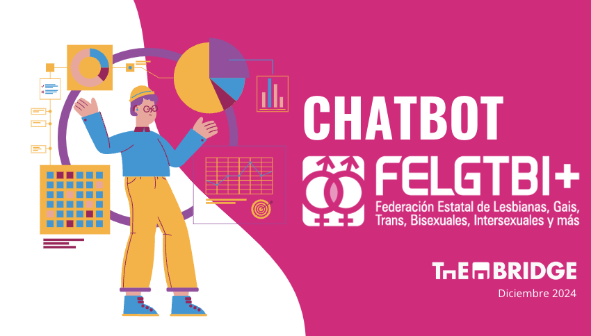
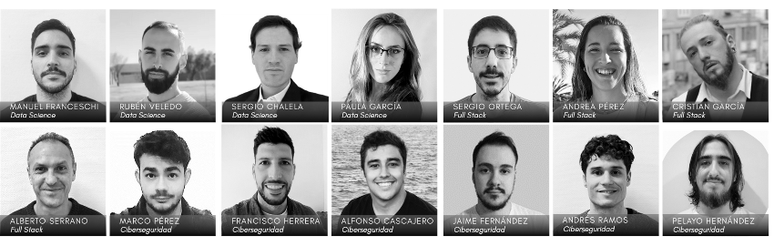

# Proyecto EVE: Chatbot para el Apoyo a la Comunidad LGTBI+

---

## Descripción

**EVE** es un chatbot desarrollado en colaboración con **FELGTBI+** (Federación Estatal de Lesbianas, Gais, Trans, Bisexuales, Intersexuales y más). Este chatbot tiene como objetivo proporcionar información accesible y personalizada para reducir el estigma asociado al vih y ofrecer recursos educativos y clínicos tanto a usuarios como a profesionales de la salud.

---

## Valores Fundamentales
1. **Interseccionalidad**: Reconocer y respetar las múltiples identidades de las personas usuarias.
2. **Accesibilidad**: Hacer la información y los recursos disponibles para todos.
3. **Confidencialidad**: Garantizar la seguridad de los datos y la privacidad.
4. **Fiabilidad Funcional**: Respuestas precisas y servicios consistentes.

---

## Funcionalidades Principales
### Para Personas Usuarias:
- **Información sobre vih e ITS**:
  - Tipos de pruebas disponibles y centros cercanos.
  - Probabilidad de riesgo y confidencialidad médica.
  - Derechos laborales y sociales.
  - Métodos de prevención como PrEP y PEP.
- **Recursos Educativos**:
  - Normalización del vih.
  - Guías para pacientes con diagnóstico reciente.
- **Soporte Psicológico**:
  - Atención y derivación profesional.

### Para Profesionales de la Salud:
- Consultas sobre manejo clínico.
- Coinfecciones asociadas al vih.
- Recursos educativos actualizados.

---

## Estrategia Digital
- **IA Personalizada**:
  - GEMINI: modelo de lenguaje avanzado para adaptabilidad y personalización.
- **Infraestructura**:
  - AWS para escalabilidad y seguridad.
  - PostgreSQL para gestión eficiente de datos.
- **Desarrollo Integral**:
  - Conexión optimizada entre frontend y backend.
  - Interfaz intuitiva para una experiencia de usuario amigable.

---

## Seguridad
- **Modelo de Amenazas**: Identificación y mitigación de riesgos potenciales.
- **Medidas de Protección**:
  - Hardening del sistema.
  - Análisis estático de código.
  - Pruebas de penetración (Pentest).
  - Mantenimiento continuo.

---

## Impacto Comunitario
- **Reducción del Estigma**: Ayuda a normalizar y educar sobre el vih.
- **Acceso a Recursos**: Promueve la prevención con herramientas como PrEP y PEP.
- **Apoyo a Profesionales**: Proporciona información actualizada y recursos clínicos.

---

## Funcionalidades Principales

- **Información sobre prevención, diagnóstico y tratamiento del vih.**
- **Recursos para apoyo emocional y manejo clínico.**
- **Adaptación del contenido según el perfil del usuario (personas con vih o profesionales).**
- **Recopilación de datos estadísticos anónimos para mejorar el servicio.**

---

## Tecnologías Utilizadas

- **Lenguaje de Programación:** Python
- **Framework de Backend:** FastAPI
- **Frontend:** HTML, CSS, JavaScript
- **Base de Datos:** PostgreSQL
- **IA Generativa:** Gemini LLM (Google)
- **Herramientas de Análisis de Datos:** Pandas, Plotly, SQL
- **Ciberseguridad:** Encriptación, Anonimización de Datos, Pruebas de Seguridad
- **Despliegue:** Docker, Render
- **Control de Versiones:** GitHub

---

## Equipo de Desarrollo

### Data Science

El equipo de **Data Science** se encargó del análisis de datos, entrenamiento de modelos y personalización de respuestas del chatbot:

1. **Manuel Franceschi**
2. **Rubén Veledo**
3. **Sergio Chalela**
4. **Paula García**

#### Tareas Realizadas por Data Science:

- **Análisis Exploratorio de Datos (EDA)** para entender las tendencias y necesidades de los usuarios.
- **Creación de modelos de IA** basados en **Gemini LLM** para proporcionar respuestas precisas y adaptadas.
- **Generación de gráficos y visualizaciones** usando **Plotly** para el análisis de las interacciones.
- **Recopilación y procesamiento de datos anónimos** para mejorar continuamente el rendimiento del chatbot.

### Full Stack

El equipo de **Full Stack** desarrolló la infraestructura del chatbot, asegurando una experiencia de usuario eficiente e intuitiva:

1. **Sergio Ortega**
2. **Andrea Pérez**
3. **Cristian García**
4. **Alberto Serrano**

#### Tareas Realizadas por Full Stack:

- **Desarrollo del Frontend y Backend** utilizando **FastAPI** y tecnologías web modernas.
- **Integración de la IA generativa** en la interfaz del chatbot.
- **Gestión de la base de datos PostgreSQL** para almacenar y recuperar información de manera eficiente.
- **Despliegue del chatbot con Docker y Render**, garantizando disponibilidad 24/7.

### Ciberseguridad

El equipo de **Ciberseguridad** garantizó que los datos y las interacciones sean seguras y confidenciales:

1. **Marco Pérez**
2. **Francisco Herrera**
3. **Alfonso Cascajero**
4. **Jaime Fernández**
5. **Andrés Ramos**
6. **Pelayo Hernández**

#### Tareas Realizadas por Ciberseguridad:

- **Implementación de encriptación** para proteger los datos de los usuarios.
- **Anonimización de datos sensibles** para garantizar la confidencialidad.
- **Pruebas de seguridad periódicas** para identificar y corregir vulnerabilidades.
- **Cumplimiento de normativas de protección de datos** y buenas prácticas de seguridad.

---

## Demo del Chatbot

Escanea el siguiente código QR para acceder a la demo de **EVE**:

---

## Contacto

Para más información sobre el proyecto o colaboración, contacta a través de [FELGTBI+](https://felgtbi.org).

---

### Imágenes del Proyecto

